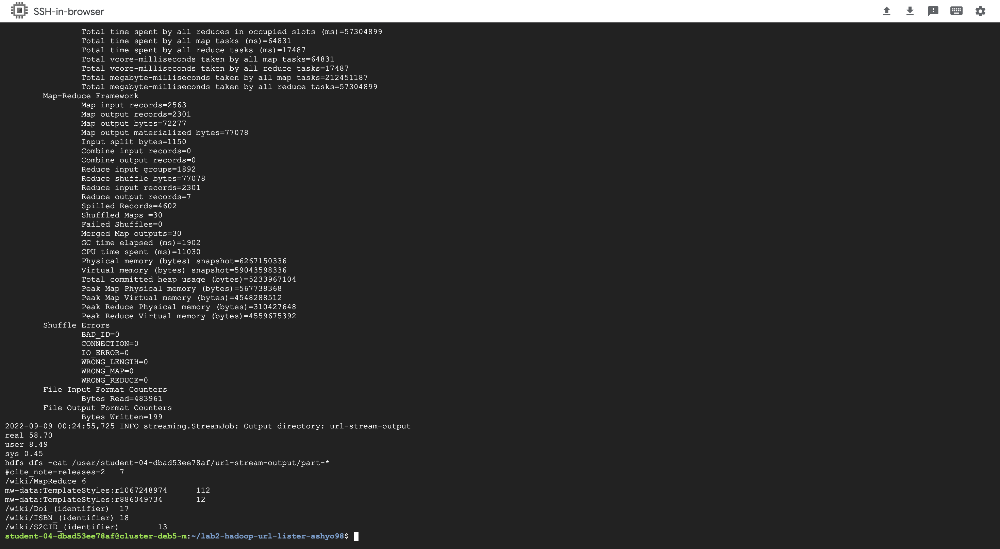
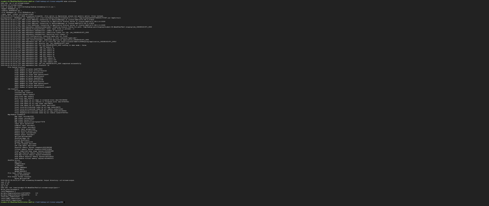

# 1. Map-Reduce for URL count

By referring to Mapper.py and Reducer.py, I created 2 new files URLMapper.py and URLReducer.py . The new mapper runs the regex `r'href=[\'"]?([^\'" >]+)'` [1] over each line and extracts the url present after `href="`. The update reducer adds the check of greater than 5. Also, Added a new option in the make file to execute the url stream hadoop files. 

# 2. Output and Screenshots 

### output with 2 worker nodes

Time taken to execute 60.9s 

### output with 4 worker nodes - 1st attempt

Time taken to execute 58.7s 

### output with 4 worker nodes - 2nd attempt

Time taken to execute 47.65s 

### output with 4 worker nodes - 3rd attempt

Time taken to execute 45.45s 

The total time taken to execute with 4 worker nodes is lesser than time taken to complete with 2 worker nodes. Moreover, creating the same job again with 4 worker nodes the overall time reduced with each iteration until a point. No significant improvement because the input file is a small in size.

# 3. Combiner 

The combiner used in the WordCount1.java file would work for both URL count as well as Word Count. But in case the check condition (count should be greater than 5) is added to it then the output of the Map-Reduce would be incorrect as the combiner is only running that check on the intermediate key-value pair and not the final one of all mappers. 

# 4. References
[1] for url regex in a HTML file - https://stackoverflow.com/questions/499345/regular-expression-to-extract-url-from-an-html-link and https://www.geeksforgeeks.org/python-regex/